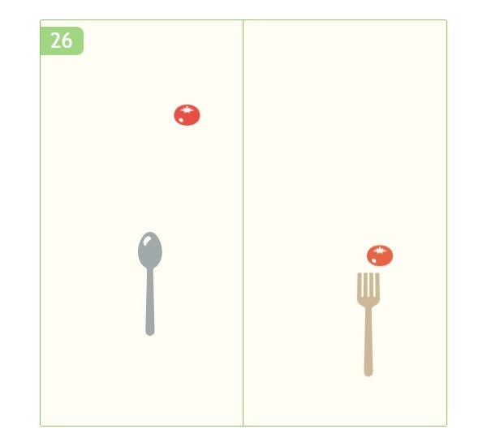

Spoon & Fork vs. Tomatoes
====



TypeScript製のミニゲームです。  
キーボードとマウスでスプーンとフォークを操作し、トマトを集めていきます。

[ブラウザでプレイ](https://yamada1ta.github.io/demo/vstomato/index.html)

## 操作
WASDキー：スプーンの移動
マウス移動：フォークの移動

自機がトマトに触れるとスコア加算。
トマトが画面下から外に出るとゲームオーバー。

## ビルド手順
npmを使用するため、[Node.js](https://nodejs.org)のインストールが必要です。

### 依存ライブラリの導入
リポジトリをクローンした後、`npm install`を実行してください。

### ローカルで実行
```
npm run serve
```
上記コマンドを実行後、http://localhost:4000 にアクセスしてください。

### ビルド
```
npm run build
```
distディレクトリにファイルが出力されます。

## ライセンス
[MIT](LICENSE)

ただし、/public/assets/images/以下の画像ファイルについては、[こちらのサイト](https://icon-rainbow.com/)のライセンスに準拠してください。

## 作成者
[yamada1ta](https://github.com/yamada1ta)
